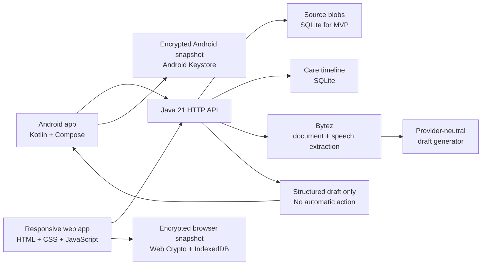

# Architecture

## Scope and design rule

The application is a consumer-facing organizer. AI produces a draft; a caregiver approves changes before any task, reminder, or family update becomes durable or shareable.

## System design



## Android layers

```text
feature/     Compose screens, state, and navigation by user workflow
core/model/  Stable domain data types
data/        Local cache, authenticated API client, repository implementations
core/privacy/Rules that enforce human confirmation and sensitive-data boundaries
di/          Dependency wiring
```

The feature packages are deliberately workflow-oriented:

```text
capture/   select source, scan document, record voice note, upload
review/    compare source evidence, correct and confirm AI draft
tasks/     today list, reminders, completion
timeline/  past care events, documents, approved summaries
profile/   care-recipient and family-member settings
```

`review/` is a required gate; no output from `capture/` can be shared or turned into a reminder without it.

## Backend responsibilities

The Android and web clients authenticate the user and submit source material. The Java backend:

1. authorizes the user for the selected care profile;
2. creates a short-lived private upload URL;
3. sends image/PDF pages or audio to Bytez for source transcription when configured;
4. converts the extracted wording into deterministic task suggestions and validates the draft;
5. returns only an extraction draft;
6. persists only caregiver-confirmed tasks and summaries;
7. supports export and deletion requests.

Language preferences are stored on the user record. Fixed interface strings live in client-side English/Russian/Spanish dictionaries. Dynamic source, event, and task content is stored only in its canonical original form; authenticated clients request transient translations from the backend, which keeps the Bytez credential private. If translation is unavailable, clients display the original content.

Never place a Bytez or model-provider secret in either client. Never log raw documents, prompts, extraction responses, recipient names, or medication data.

Both clients are offline-readable after their first authenticated synchronization. They cache the complete last-known profile, draft list, and event/task timeline as an encrypted snapshot. Android protects its AES key with Android Keystore; the web client uses a non-exportable Web Crypto key stored in IndexedDB while its service worker caches only static application files. Cached data is cleared on sign-out and account deletion. The MVP deliberately does not queue offline mutations, preventing local/server conflict resolution from being implied where it does not yet exist.

Credential placement is strict: `BYTEZ_API_KEY` and any `BYTEZ_PROVIDER_KEY` exist only in the backend environment; `GOOGLE_CLIENT_IDS` is the backend audience allowlist; the matching Google Web client ID is public configuration used by web and Android. Neither client contains an OAuth client secret or an AI-provider key.

For the MVP, password hashes, unique Google subject identifiers, bearer-session hashes, profiles, source blobs, drafts, events, tasks, exports, and cascading deletion are persisted in SQLite. Google ID tokens are verified only on the Java backend; clients receive a revocable CareBinder session. The production deployment must add TLS and encrypted storage at rest.

## Core data model

```text
User 1---* CareRecipient 1---* CareEvent 1---* CareTask
                               |
                               *---* DocumentAsset
                               |
                               1---1 ExtractionDraft (until confirmation)
```

`ExtractionDraft` is an ephemeral, reviewable object. A confirmed action receives a provenance pointer (`sourceText` plus document/event reference) so the caregiver can find the original source.

## Security stages

### Consumer beta

- Authentication and per-user authorization.
- TLS in transit and encrypted storage at rest.
- No ad SDKs, behavioral analytics, or PHI/health-data logging.
- User-initiated export and deletion.
- Explicit consent before family sharing.
- Server-only AI calls; use synthetic data in development and tests.

### HIPAA-capable future

Only enter this stage after a signed provider/partner requirement. Use a BAA-covered cloud and AI configuration, conduct a risk analysis, sign BAAs with relevant vendors, implement auditable access, documented incident response, retention controls, and legal review. This scaffold does not claim HIPAA compliance.

## AI contract

AI output must be schema-validated and contain source references. It must not:

- diagnose or infer a condition;
- recommend treatment or dosage;
- assign urgency not explicit in the source;
- automatically communicate with clinicians or family;
- create a reminder without user confirmation.

If extraction confidence is low or source text conflicts, show the original content and require manual entry.
